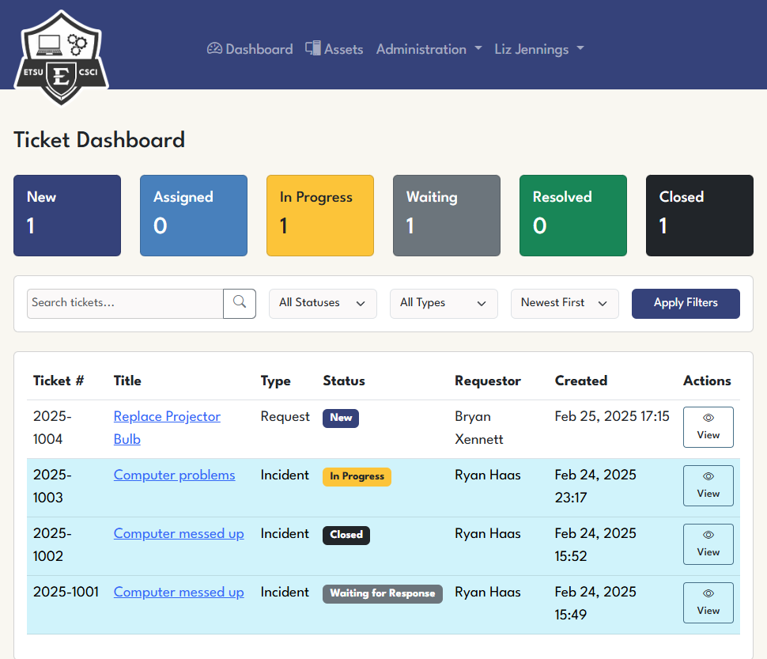
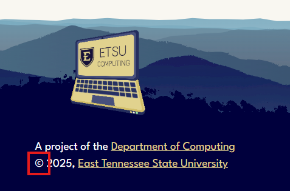
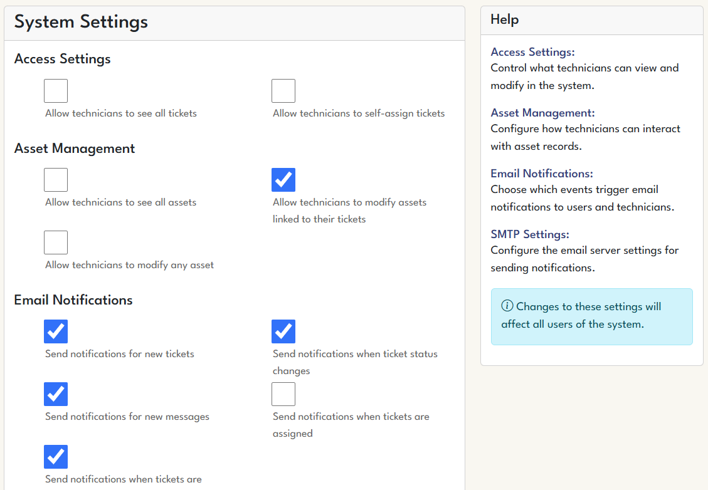
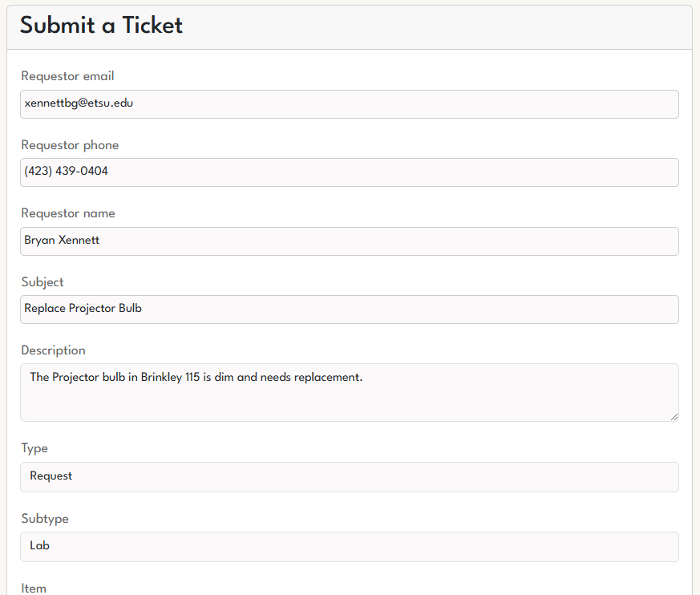
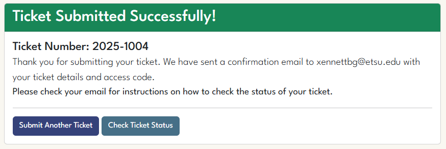
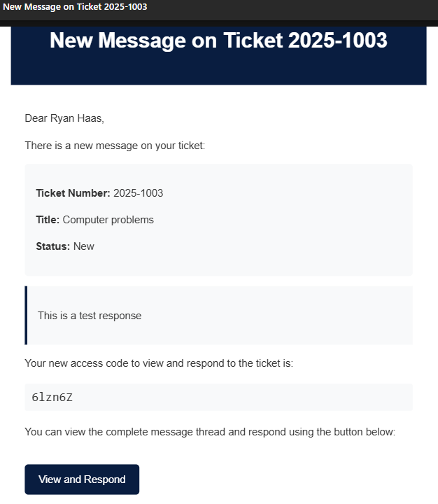
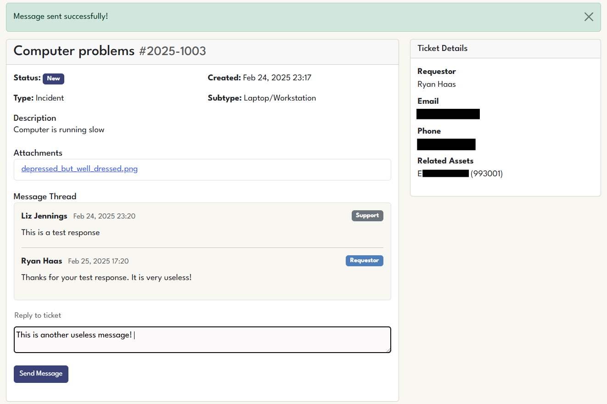
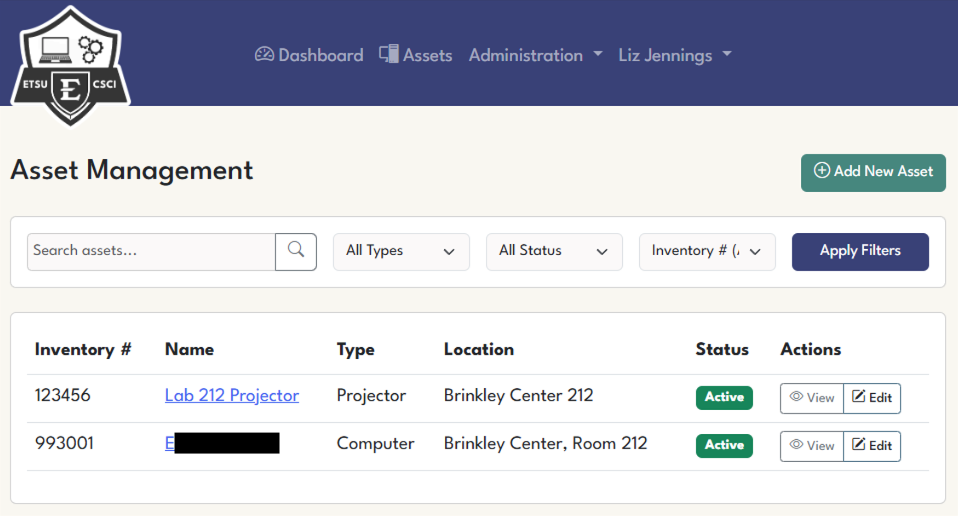

# ETSU Computing Helpdesk Ticketing System

A Django-based ticketing system built for the Departments of Computing and Digital Media at East Tennessee State University. This system allows Liz Jennings (Systems Manager) and her student workers to track and manage service requests for faculty, labs, and other computing equipment.



## Features

- **Public Ticket Submission Portal**
  - Categorized ticket submission with type/subtype/item selection
  - File attachments (up to 5MB per file)
  - Asset association via inventory number
  - Email notifications
  - Passwordless ticket access

- **Technician Dashboard**
  - Ticket management interface
  - Status updates with history
  - Message thread system
  - Search and filtering capabilities
  - Pagination for large ticket volumes

- **Asset Management**
  - Inventory tracking
  - Asset type categorization
  - Ticket association
  - Location tracking
  - Purchase date and status tracking

- **User Management**
  - System Managers and Technicians
  - Create/edit/delete users
  - Toggle active status
  - Ticket reassignment during deletion

- **System Settings**
  - Permission controls
  - Notification preferences
  - SMTP configuration

## Installation

### Prerequisites

- Python 3.12.2
- Django 5.0+
- Virtual environment (recommended)

### Setup

1. Clone the repository (using SSH key):
   ```bash
   git clone git@github.com:ryan-etsu-computing-projects/helpdesk.git
   cd helpdesk
   ```

2. Create and activate virtual environment:
   ```bash
   python -m venv venv
   source venv/bin/activate  # On Windows: venv\Scripts\activate
   ```

3. Install dependencies:
   ```bash
   pip install -r requirements.txt
   ```

4. Configure environment variables (or .env file):
   ```
   DJANGO_SECRET_KEY=your_secret_key
   DEBUG=True
   ALLOWED_HOSTS=localhost,127.0.0.1
   ```

5. Run migrations:
   ```bash
   python manage.py makemigrations accounts
   python manage.py makemigrations tickets
   python manage.py makemigrations assets
   python manage.py migrate
   ```

6. Create static folders:
   ```bash
   mkdir -p static/css static/img
   ```

7. Create first system manager account:
   ```bash
   python manage.py create_system_manager username email@etsu.edu password "First" "Last" "Systems Manager" "Computing,Digital Media"
   ```

8. Run the development server:
   ```bash
   python manage.py runserver
   ```

9. Access the system at http://127.0.0.1:8000/

## Database Management

### Running Migrations

When you make changes to models, run:
```bash
python manage.py makemigrations
python manage.py migrate
```

### Database Backup

Backup the database:
```bash
python manage.py dumpdata > backup.json
```

Restore the database:
```bash
python manage.py loaddata backup.json
```

## User Management

### Creating the Initial System Manager

The `create_system_manager` command creates the first system manager account:

```bash
python manage.py create_system_manager [username] [email] [password] [first_name] [last_name] [job_title] [departments]
```

Example:
```bash
python manage.py create_system_manager ljennings ljennings@etsu.edu SecureP@ssw0rd "Liz" "Jennings" "Systems Manager" "Computing,Digital Media"
```

Parameters:
- `username`: Login username
- `email`: Must be an @etsu.edu address
- `password`: Must be at least 15 characters
- `first_name`: First name
- `last_name`: Last name
- `job_title`: Position title
- `departments`: Comma-separated list of departments

### Adding Users Through the Interface

#### Logging In

The administrative login link (`/accounts/login/`) is hidden on the copyright symbol in the website's footer:



Once logged in as a system manager:
1. Click "Administration" in the top navigation
2. Select "Manage Users"
3. Click "Add Technician" or "Add System Manager"
4. Fill in the required information
5. Click "Create"

## System Configuration

### Settings Interface

Access the settings page:
1. Log in as a system manager
2. Click "Administration" in the top navigation
3. Select "System Settings"

Key settings include:
- **Access Settings**: Control ticket and asset visibility
- **Asset Management**: Control who can modify assets
- **Email Notifications**: Toggle notification types
- **SMTP Settings**: Configure email sending



## Ticket Management

### Public Submission

Users can submit tickets at `/submit/` without logging in.





### Checking Ticket Status

Users can check ticket status at `/access/` using:
- Their email address
- Ticket number
- Access code (provided in notification emails)





### Technician Dashboard

Technicians can:
- View assigned tickets
- Update ticket status
- Add messages
- Manage related assets

System managers can additionally:
- View all tickets
- Assign tickets to technicians
- Configure system settings

## Asset Management



### Asset List

Click "Assets" in the top navigation to view all assets at `/assets/`

### Adding Assets

1. Click "Add New Asset" button
2. Fill in required information
3. Click "Create Asset"

### Ticket-Asset Association

You can:
- Associate assets during ticket creation
- Add assets to existing tickets
- Remove assets from tickets

## Email Notifications

The system sends notifications for:
- Ticket creation
- Status changes
- New messages
- Ticket assignment

Each notification includes:
- Ticket details
- An access code for viewing the ticket
- A direct link to the ticket

## Troubleshooting

### Common Issues

**Migration errors:**
- Ensure all apps are listed in INSTALLED_APPS
- Try `python manage.py migrate --fake-initial`

**Static files not loading:**
- Check STATIC_URL and STATICFILES_DIRS in settings.py
- Run `python manage.py collectstatic`

**Email sending failures:**
- Verify SMTP settings
- Check console for error messages
- Ensure email templates exist in correct locations

## Future Plans

- Email integration for automatic ticket creation
- Reporting and analytics
- API access for integration with other systems
- Mobile app support

## License

Copyright 2025 Ryan Haas (haasrr@outlook.com)

Permission is hereby granted, free of charge, to any person obtaining a copy of this software and associated documentation files (the “Software”), to deal in the Software without restriction, including without limitation the rights to use, copy, modify, merge, publish, distribute, sublicense, and/or sell copies of the Software, and to permit persons to whom the Software is furnished to do so, subject to the following conditions:

The above copyright notice and this permission notice shall be included in all copies or substantial portions of the Software.

THE SOFTWARE IS PROVIDED “AS IS”, WITHOUT WARRANTY OF ANY KIND, EXPRESS OR IMPLIED, INCLUDING BUT NOT LIMITED TO THE WARRANTIES OF MERCHANTABILITY, FITNESS FOR A PARTICULAR PURPOSE AND NONINFRINGEMENT. IN NO EVENT SHALL THE AUTHORS OR COPYRIGHT HOLDERS BE LIABLE FOR ANY CLAIM, DAMAGES OR OTHER LIABILITY, WHETHER IN AN ACTION OF CONTRACT, TORT OR OTHERWISE, ARISING FROM, OUT OF OR IN CONNECTION WITH THE SOFTWARE OR THE USE OR OTHER DEALINGS IN THE SOFTWARE.

## Credits

Developed for the Department of Computing at East Tennessee State University.
